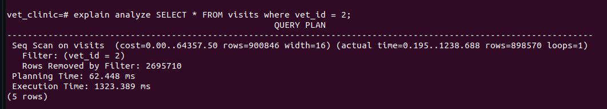
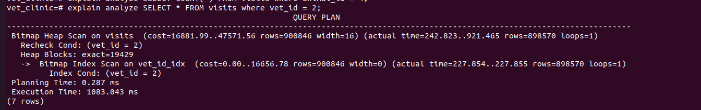
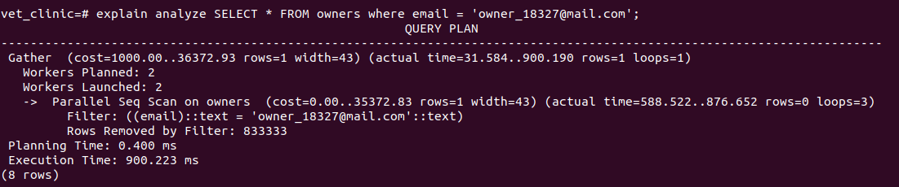

# vet_clinic_db

This project is built as practice for optimizing search queries in a populated database. We first set up the database tables and populated them. We then ran queries on the dadtabase and recorded the time taken. After that we optimized the database and recorded the time taken to run queries. Below are screenshots of queries ran obefore and after the optimization.

## Query Example 1

explain analyze SELECT * FROM visits where vet_id = 2;

## Before optimization

## After optimization

## Query Example 2

explain analyze SELECT * FROM owners where email = 'owner_18327@mail.com';

## Before optimization

## After optimization

## Built With

- Postgress

## Getting Started

To get a local copy up and running follow these simple example steps.
- Clone the repository with:
`git clone https://github.com/blakbox23/vet_clinic_db.git`

- Create the vet clinic database.
- Create tables in the databse as provided by `schema.sql`
- Run your queries

## Authors

👤 **Peter Mbuthia**

- GitHub: [@Blakbox23](https://github.com/blakbox23)
- Twitter: [@blakbox23](https://twitter.com/blakbox23)
- LinkedIn: [Peter Mbuthia](https://www.linkedin.com/in/peter-mbuthia)

👤 **Onur Onat Surmeli**

* [LinkedIn](https://www.linkedin.com/in/onur-onat-surmeli-1143ab181/)

* [Github](https://github.com/Zibilyonik)

## 🤝 Contributing

Contributions, issues, and feature requests are welcome!

Feel free to check the [issues page](https://github.com/blakbox23/vet_clinic_db/issues).

## Show your support

Give a ⭐️ if you like this project!

## 📝 License

This project is [MIT](./MIT.md) licensed.
